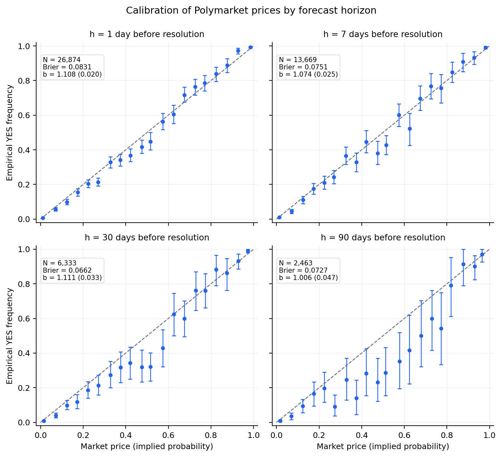
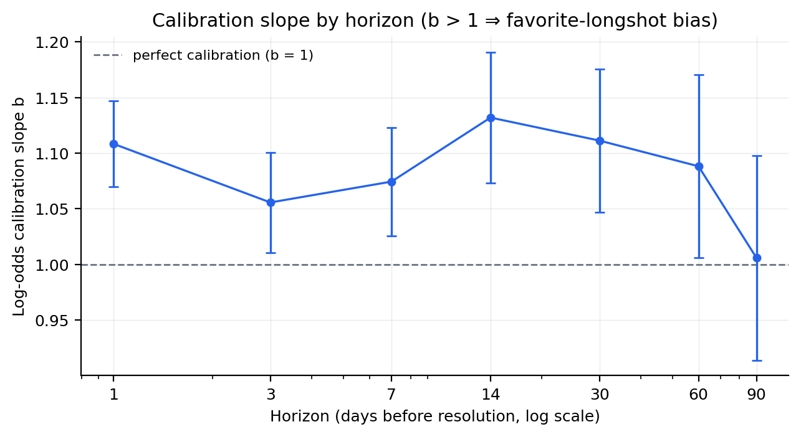
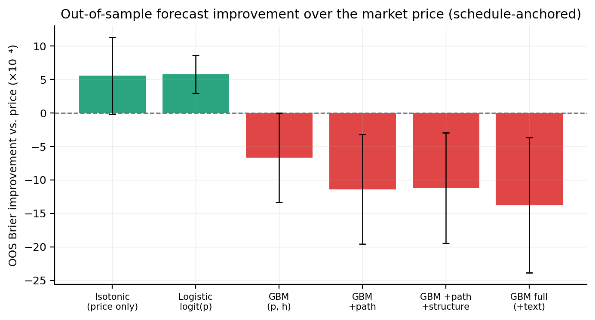

# Polymarket Forecasting & Market Efficiency

A research pipeline that evaluates prediction-market prices as probability
forecasts and tests whether recalibration or machine learning improves them.
It combines daily YES-token price histories from Polymarket's CLOB API with
market metadata from the Gamma API. The data are daily prices and metadata;
historical order-book depth and order flow are not used.

Two linked studies cover calibration, favorite–longshot bias, and transaction
costs, followed by a monthly walk-forward comparison of logistic recalibration,
isotonic regression, and LightGBM models with price, path, structure, and text
features.

## Research questions

1. Are Polymarket prices calibrated probability forecasts, and how does
   calibration change as the forecast horizon lengthens?
2. Do prices carry systematic biases, such as a favorite–longshot bias or a
   premium on the YES side?
3. Can simple strategies that trade against those biases make money after a
   1¢ spread?
4. Can recalibration or a machine-learning model beat the market price out of
   sample, and does trading on model–price disagreement survive costs?

## Pipeline

```text
01_fetch_markets   Gamma API market metadata
       |
       v
03_build_sample    binary, cleanly resolved CLOB markets, volume >= $1,000
       |
       v
02_fetch_prices    CLOB API daily YES prices for the sampled markets
       |
       +--------------------------------+
       v                                v
Calibration study                    Forecast-model study
04_build_panel  market x horizon     08_features    snapshots for both anchorings,
                panel, 1-90 days,                   price-path and structure features
                two date anchorings  09_model       category and TF-IDF/SVD text features,
05_analysis     calibration, bias                   monthly walk-forward model ladder
                tests, backtests     10_interpret   diagnostics, divergence backtest
06_figures      figures/calibration/ 12_supplement  blends, mature folds
07_tables       markdown tables      11_figures2    figures/models/, tables
```

Each numbered script is one stage that reads saved outputs from earlier
stages, so a stage can be rerun on its own once its inputs exist.

## Results

The historical sample contains 26,896 markets with usable price histories, of
which 26,887 contribute 83,773 market–horizon observations to the calibration
panel. Scheduled end dates are restricted to July 31, 2025 or earlier, with a
lifetime-volume threshold of $1,000. This retrospective filter limits the
population to which results apply.

### Calibration and trading after costs

The calibration panel prices each market h days before its closure-time proxy,
at seven horizons from 1 to 90 days (26,874 markets at 1 day, 2,463 at 90).

- **Prices are close to calibrated but show a favorite–longshot bias.** A
  logistic regression of outcomes on price log-odds gives slopes between 1.01
  and 1.13 across the seven horizons (1.07 at 7 days, event-clustered SE 0.025).
  A slope above 1 means favorites resolve YES more often than their prices
  imply and longshots less often. Quotes anchored to scheduled end dates give
  similar slopes (1.02 to 1.13).
- **Mid-priced contracts are overpriced, and more so at long horizons.**
  Contracts priced between 10% and 90% resolve YES 2.5 percentage points less
  often than their prices imply one day out, and 10.5 points less at 90 days.
- **The biases are not reliably tradable after costs.** Buying NO on
  longshots priced 1–10% seven days out returns 1.2% per trade before costs
  (event-clustered t = 4.5) and 0.1% after a 1¢ spread (t = 0.5). Six
  net-of-cost tests cover buying favorites priced 90–99% and fading longshots,
  at 7 and 30 days, plus a 30-day schedule-anchored check. Only the 30-day
  longshot fade keeps an event-clustered t above 2 after costs (+0.9% per
  trade, t = 2.8), and it falls to +0.6% (t = 1.7) when quotes are anchored to
  scheduled end dates. Weighting months equally, the six net monthly-mean
  t-statistics range from −0.7 to 1.2.



In the calibration figures, "resolution" refers to the closure-time proxy
described under [Design and limits](#design-and-limits).



### Forecast models

The primary model comparison uses **57,957 evaluated observations across 26 test
months and 6,167 event clusters**. These are market observations at multiple
horizons, not 57,957 distinct markets. Lower Brier scores are better.

| Forecast | Pooled Brier score, scheduled-end anchoring |
| --- | ---: |
| Market price | 0.0774024 |
| Logistic recalibration | 0.0768240 |
| Isotonic recalibration | 0.0768463 |
| Full LightGBM model | 0.0787792 |

The logistic model reduces pooled Brier error by about 0.75%, while the full GBM
underperforms the price in this pooled comparison. The logistic improvement is
not consistent under equal weighting of test months: the saved monthly
t-statistic is −0.20, versus 4.05 under event-clustered inference. Results also
vary by horizon and by scheduled-end versus closure-time-proxy anchoring.

Trading on model–price disagreement does not reliably survive costs either.
Using the schedule-anchored out-of-sample predictions, the backtest buys the
side the full GBM favors whenever its forecast differs from the price by more
than 2, 5 or 10 points. After a 1¢ spread, the pooled event-clustered t is 2.4
at the 10-point threshold (+6.3% per trade), but the monthly-mean t-statistic
ranges from −1.2 to 0.2 across the three thresholds, so the gains are not
consistent from month to month.

The Brier scores come from [saved model metrics](results/models/model_metrics.json).
The [calibration analysis](results/analysis.json),
[model diagnostics and divergence backtest](results/models/interpretation.json), and
[supplementary comparisons](results/models/supplement.json) provide more detail.
They are archived outputs with known timing limitations, including some
post-closure snapshots, as detailed under [Design and limits](#design-and-limits).
They do not establish fully point-in-time forecast performance or profitable
trading after realistic execution costs. The checks below do not refit the
full historical study.



The model-comparison error bars use event-clustered standard errors. They do not
represent the equal-month inference described above.

## Run offline checks

Use Python 3.11 and run these commands from this folder:

```bash
python3.11 -m venv .venv
source .venv/bin/activate
python -m pip install -r requirements.txt
python code/00_setup.py
python -m unittest discover -s tests -v
python code/07_tables.py
```

On Windows, activate with `.venv\Scripts\Activate.ps1` in PowerShell. On macOS,
LightGBM may also need the native OpenMP runtime (`brew install libomp`).
The dependencies include NumPy, pandas, SciPy, statsmodels, matplotlib,
scikit-learn, LightGBM, and PyArrow.

The tests exercise research calculations using synthetic inputs, run stages 03,
04, 05, 07 and 08 end to end on the [synthetic sample](#synthetic-sample) in a
temporary copy, and check consistency of the saved aggregates. The final command
regenerates calibration tables at `results/tables.md` from the included JSON
without network access.
Every script locates the project relative to its own file, so moving the folder
or running an absolute script path from a different working directory works.

## Data and reproduction

Aggregate statistics and figures are included. The historical raw market
records, price histories, processed datasets, and per-observation predictions
are **not bundled**; only the synthetic sample below is. Consequently this
folder alone cannot reproduce the historical estimates or regenerate every
figure. The original environment was not fully archived;
dependency pins describe a reproduction environment rather than an exact record
of the historical run.

### Synthetic sample

`sample/` holds a small synthetic dataset (about 430 KB) in the two raw input
formats described below: 293 metadata rows in `markets_meta.jsonl` and one
price-history record for each of the 231 markets that pass the inclusion
filters in `price_histories.jsonl`. `sample/make_sample.py` generates both files
deterministically. Every market, place, team and price is invented; none of it
is Polymarket data, and statistics computed from it are not research results.

Prices follow a latent-path model in which each quote starts as a calibrated
probability. The generator then plants a favorite–longshot bias: true log-odds
are 1.1 times the quoted log-odds. Some metadata rows each fail exactly one
inclusion filter in `03`. Some histories are failed, empty, single-print or
gapped. Together they exercise every sample-construction count and the
1.5-day staleness limit.

To run the early stages on the sample without touching the included results:

```bash
python sample/run_sample.py
```

The runner copies `code/` and the sample into a new temporary project root, runs
`03`, `04`, `05`, `07` and `08` there, and prints where the outputs are; pass
`--workdir DIR` to choose a new or empty directory instead.
`tests/test_sample_pipeline.py` runs the same stages and checks filter counts,
no-look-ahead timing of panel prices and feature snapshots, and reconciliation
of the calibration outputs. The sample is too small for `06`, which plots 30-
and 90-day calibration bins that need 200 observations each, and for the model
stages `09`–`12`.

### Full pipeline

To run the full pipeline, supply the two JSONL inputs at
`data/raw/markets_meta.jsonl` and `data/raw/price_histories.jsonl`, or collect fresh
inputs using the included fetchers. The metadata schema is defined by `KEEP`
and the event fields in `code/01_fetch_markets.py`; price histories contain an
`id`, `n`, and `history` pairs of Unix timestamp and YES price, as written by
`code/02_fetch_prices.py`.

For fresh collection, start with empty input directories in a separate copy.
Live metadata collection requires `curl` on `PATH`:

```bash
python code/00_setup.py
python code/01_fetch_markets.py
python code/03_build_sample.py
python code/02_fetch_prices.py
```

The metadata fetcher defaults to end-date windows from 2020 through 2030 and
checkpoints completed windows. `03` restricts the research sample to the cutoff
above. The price fetcher requests `/prices-history` with `interval=max` and
`fidelity=1440` for daily sampling. Fetchers resume saved IDs instead of refreshing
them. Price requests that fail are saved with `n=-1`; remove those failed records
from your working input before retrying. Metadata requests stop after six failed
attempts; changed API pagination caps may require narrower windows or changes to
the fetcher. Live API collection was not exercised for this release, and coverage
or API behavior can differ from the archived research snapshot.

With both input files available, run the calibration study:

```bash
python code/03_build_sample.py
python code/04_build_panel.py
python code/05_analysis.py
python code/06_figures.py
python code/07_tables.py
```

Then run the model comparison:

```bash
python code/08_features.py
python code/09_model.py
python code/10_interpret.py
python code/12_supplement.py
python code/11_figures2.py
```

Run `12` before `11`, because the figure/table script reads `supplement.json`.
The model stage repeatedly fits the model ladder for both date anchorings.
Random seeds are set to 42; numerical results can vary across library builds
and platforms. Pipeline runs overwrite generated results and figures, so keep
the included aggregates in a separate copy when comparing a new run.

## Design and limits

- Price-path features use observations at or before each forecast snapshot,
  with a 1.5-day staleness limit. Lifetime volume and current liquidity are
  excluded as predictive features; lifetime volume still selects the sample.
- Resolution timing uses `closedTime`, falling back to `endDate`. This is a
  closure-time proxy, not a separately verified outcome-availability timestamp.
  Monthly training requires the proxy to precede the test month but does not
  separately require every training snapshot to precede that month.
- Scheduled-end snapshots can fall at or after the closure-time proxy. A check
  of the original archived inputs and predictions found 1,396 of 57,957 primary
  test observations (2.4%) in this category, plus 35 training-row appearances
  across monthly folds with snapshots at or after the test month's start.
  Stricter timing filters and a refit are needed to establish fully point-in-time
  performance; the included results retain the original timing conventions.
- Test events overlapping training events are excluded. Early stopping holds
  out whole events, and TF-IDF/SVD text transformations are fitted on the
  burn-in sample.
- These temporal checks do not establish that all metadata was available at
  the original forecast time. Market questions, scheduled dates, event groupings,
  and universe membership were collected retrospectively.
- Closure-time-proxy anchoring is the primary design of the calibration
  study, including its 7- and 30-day backtests, and a robustness comparison in
  the model study. It is retrospective because closure times are not known in
  advance; the schedule-anchored calibration and 30-day backtest check this.
  Scheduled-end anchoring also depends on the accuracy of historical metadata.
- Calibration and model comparisons are retrospective research. Exploring
  specifications on an observed sample can influence model selection. Daily
  prices do not provide executable bid/ask quotes, depth, or a slippage model.
- The archived CORP score decomposition fits individual sorted observations
  without pooling tied prices first. Its components can depend on outcome order
  within ties; treat those components as provisional. This does not affect the
  directly computed Brier scores in the model-comparison table above.

## Files

```text
code/                 Collection, sample construction, analysis, models, figures
sample/               Synthetic raw inputs, their generator, and a stage runner
tests/                Offline checks, sample-pipeline smoke test, saved aggregates
results/              Calibration-study aggregates and calibration bins
results/models/       Model-comparison metrics, diagnostics, and supplement
figures/calibration/  Calibration-study figures
figures/models/       Model-comparison figures
requirements.txt      Python 3.11 dependency pins
LICENSE               MIT license for original code and documentation
```

## License

Original code and documentation are licensed under the [MIT License](LICENSE).
Third-party data and linked sources remain subject to their respective terms.
